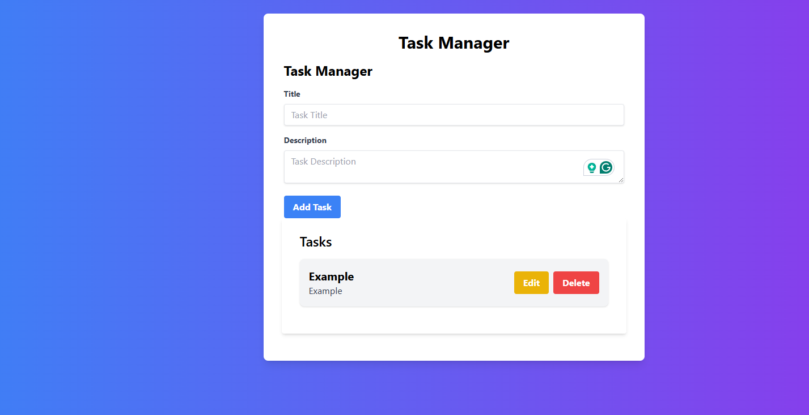

# 📝 Task Manager

Welcome to the **Task Manager** application! This is a full-stack application built with Laravel on the backend and Vue.js on the frontend, using Vite for bundling. The application allows users to create, read, update, and delete tasks. 

## 🚀 Features

- **Add Tasks:** Create new tasks with a title and description.
- **View Tasks:** View a list of all tasks.
- **Edit Tasks:** Update the details of existing tasks.
- **Delete Tasks:** Remove tasks that are no longer needed.
- **Responsive Design:** Looks great on both desktop and mobile devices.
- **Animated Transitions:** Smooth animations for adding and removing tasks.

## 🛠️ Technologies Used

- **Backend:** Laravel
- **Frontend:** Vue.js, Vite
- **Styling:** Tailwind CSS
- **Animations:** Vue Transition Group

## 📸 Screenshots

## 📦 Installation

### Backend

Clone the repository
  
   git clone https://github.com/yourusername/task-manager.git
   cd task-manager
Install backend dependencies:

composer install
Set up environment variables:
cp .env.example .env
php artisan key:generate
Configure your .env file:

Ensure you have the correct database configuration in your .env file. Example:

DB_CONNECTION=mysql
DB_HOST=127.0.0.1
DB_PORT=3306
DB_DATABASE=task_manager
DB_USERNAME=root
DB_PASSWORD=

Run migrations:
php artisan migrate
Serve the backend:
php artisan serve
### Frontend
Navigate to the frontend directory:

cd frontend
Install frontend dependencies:

npm install
Set up environment variables:
Create a .env file in the frontend directory and add the following:

VITE_BACKEND_URL=http://localhost:8000
Run the frontend development server:

npm run dev
📋 Usage
Open your browser and navigate to http://localhost:5173.
Use the form to add tasks.
View, edit, or delete tasks from the list.
##📚 API Endpoints
GET /api/tasks: Retrieve all tasks.
POST /api/tasks: Create a new task.
GET /api/tasks/{task}: Retrieve a specific task.
PUT /api/tasks/{task}: Update a specific task.
DELETE /api/tasks/{task}: Delete a specific task.
🤝 Contributing
Fork the repository.
Create a new branch:

git checkout -b my-new-feature
Commit your changes:

git commit -m 'Add some feature'
Push to the branch:

git push origin my-new-feature
Submit a pull request.
##📝 License
This project is licensed under the MIT License.

💬 Contact
Your Name
Email: obasantade@gmail.com
GitHub: Tadester
Happy coding! 🎉

